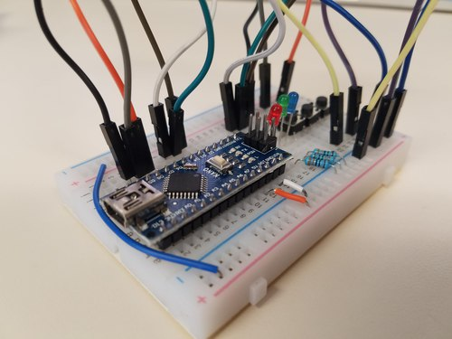

# Arduino Workshop

* [Etherpad Notes](https://public.etherpad-mozilla.org/p/arduino-workshop)

## Tinkercad

* [Tinkercad Circuits](https://www.tinkercad.com/circuits)

## Setup

Install the Arduino IDE and CH340G driver.

* [Arduino IDE](https://www.arduino.cc/en/Main/Software)
* [CH340G Drivers](docs/InstallDrivers.md)

## Parts

* [Parts Details](docs/PartsDetails.md)

## Basic Exercises

* LED Blink
  * [Blink using Delay](https://www.arduino.cc/en/Tutorial/Blink)
  * [Blink without Delay](https://www.arduino.cc/en/Tutorial/BlinkWithoutDelay)
* Button
  * [Input with Internal Pullup](https://www.arduino.cc/en/Tutorial/InputPullupSerial)
* Buzzer
  * [Tone Melody](https://www.arduino.cc/en/Tutorial/toneMelody)
* Final Project
  * [Built-In Examples](https://www.arduino.cc/en/Tutorial/BuiltInExamples)
  * [Tone Keyboard](https://www.arduino.cc/en/Tutorial/toneKeyboard)
  * [Arduino Project Hub](https://create.arduino.cc/projecthub)

## Communication Exercises

* I²C Communication
  * [Master Reader](https://www.arduino.cc/en/Tutorial/MasterReader)
  * [Master Writer](https://www.arduino.cc/en/Tutorial/MasterWriter)

## Advanced IoT Topics

### Potential Topics

* [ESP8266 w/ WiFi](https://en.wikipedia.org/wiki/ESP8266)
* [MySensors](https://www.mysensors.org/)
* [Firebase real time database](https://firebase.google.com/docs/database/)
