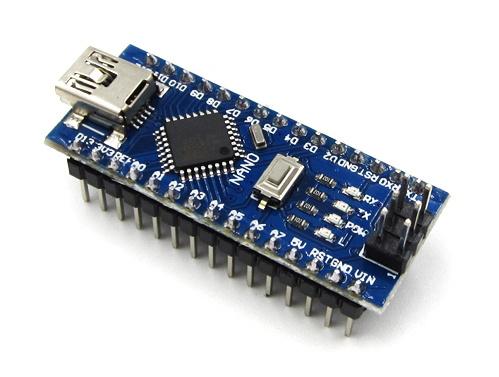
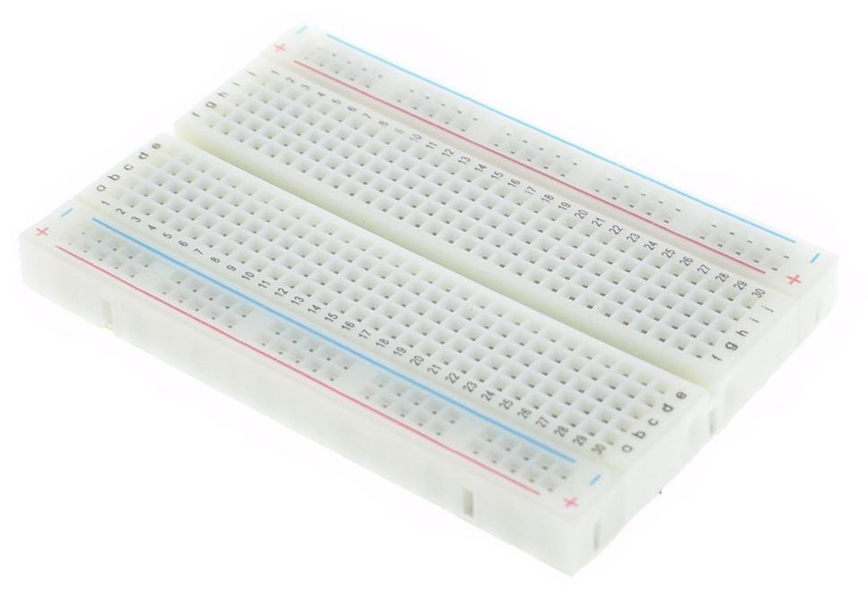
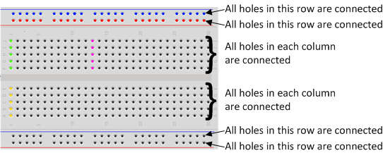
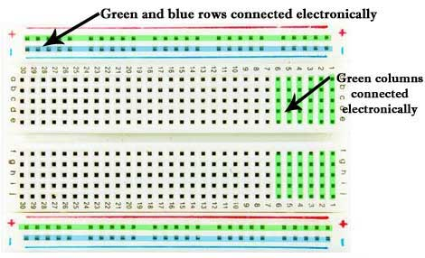
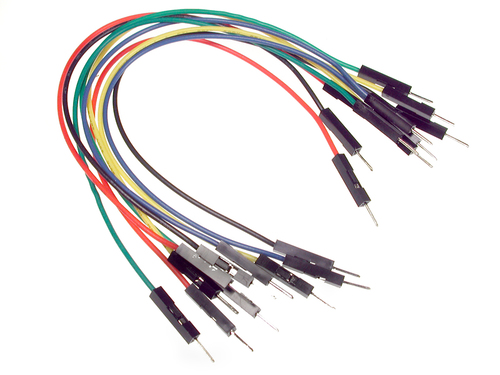
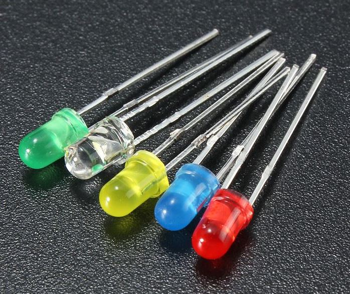
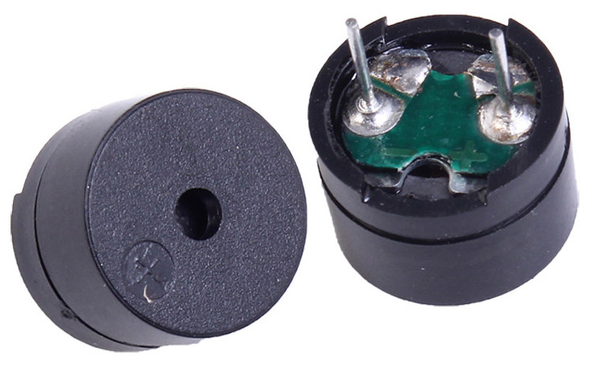
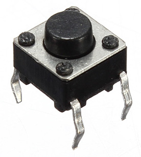
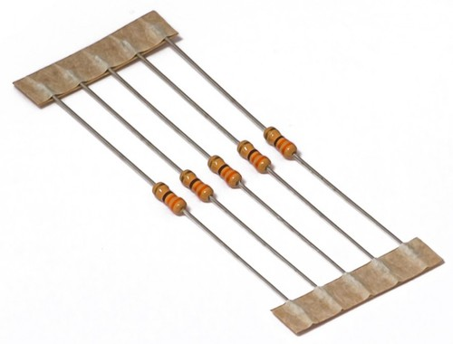
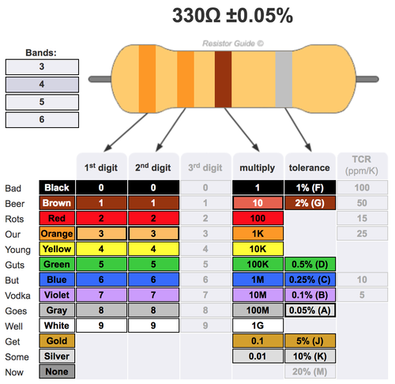

# Parts

## Arduino Nano

Arduino is an open source hardware project started in 2003.

* [Arduino wiki](https://en.wikipedia.org/wiki/Arduino)
* [Official Store](https://store.arduino.cc/usa/arduino-nano)

## Breadboard

A solderless breadboard is the base for prototyping electronics.

* [Breadboard wiki](https://en.wikipedia.org/wiki/Breadboard)

### Connection Guide

## M-M Jumper Wires

Used for connecting components on a breadboard.

* [Jumper wire wiki](https://en.wikipedia.org/wiki/Jump_wire)

## LEDs

* [LED circuit wiki](https://en.wikipedia.org/wiki/LED_circuit)

## Passive Buzzer

* [Buzzer wiki](https://en.wikipedia.org/wiki/Buzzer)

## Push Button Switch

* [Pushbutton Tutorial](https://www.arduino.cc/en/Tutorial/Pushbutton)

## Resistor

* [Resistor wiki](https://en.wikipedia.org/wiki/Resistor)
* [Online Calculator](http://www.resistorguide.com/resistor-color-code-calculator/)

### Color Codes

