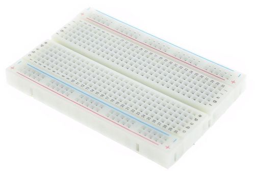

# Parts

## Arduino Nano

`TODO: description`

## Breadboard

`TODO: description`

### Connection Guide

## M-M Jumper Wires

`TODO: description`

## LEDs

`TODO: description`

## Passive Buzzer

`TODO: description`

## Push Button Switch

`TODO: description`

## Resistor

`TODO: description`

### Color Codes

[Online Calculator](http://www.resistorguide.com/resistor-color-code-calculator/)